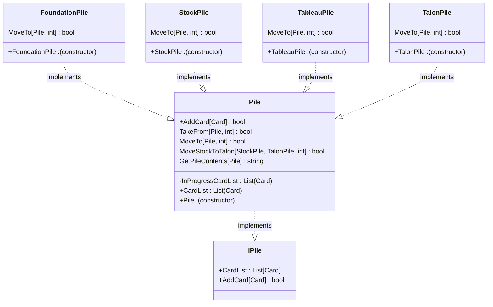
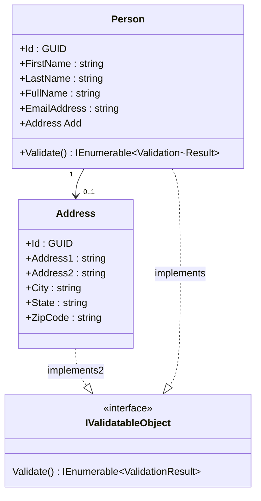
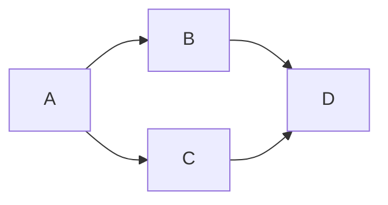
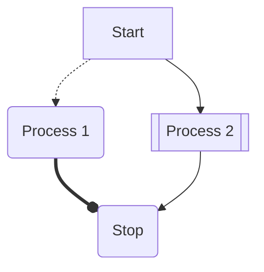

# SolitareTDD
Just some TDD practice for the group, and this time solitaire was not mis-typed! :-)  
Design decisions are written in MS Word saved as .htm  and is located here: JChrisCompton » Solitaire_TDD » SolitaireTDD » TDD Design Decisions_files

---

## TDD Class Diagram Attempt

- - -

# Markdown practice 
This is practice with markdown.
## This IS NOT related to the TDD project!

This is all Markdown practice:

## Class Diagram Sample

		-privateProperty : string
		#ProtectedProperty : string
		%InternalProperty : string
Internal should be a tilda "~", but we're using a percent "%" because the markdown editor is a little broken.

## Flowcharts

